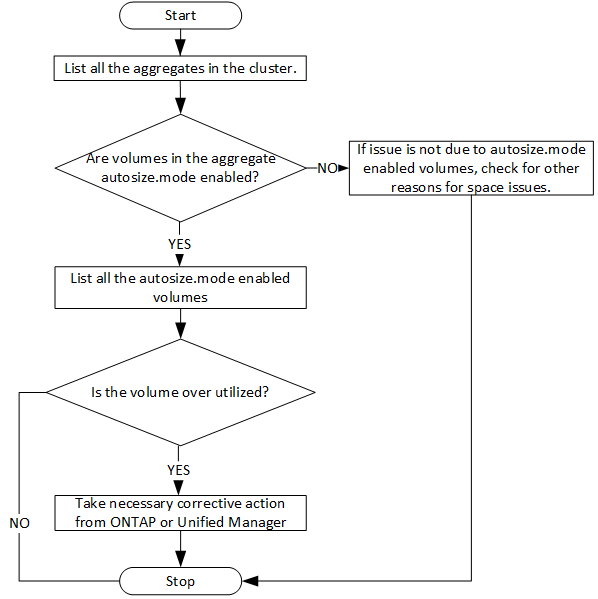

= Détermination des problèmes d'espace dans les agrégats à l'aide d'API
:allow-uri-read: 
:icons: font
:imagesdir: ../media/

[role="lead"]
Vous pouvez utiliser les API de data Center de Active IQ Unified Manager pour surveiller la disponibilité et l'utilisation de l'espace dans vos volumes. Vous pouvez identifier les problèmes d'espace de votre volume et les ressources de stockage sur-exploitées ou sous-utilisées,

Les API de data Center pour les agrégats récupère les informations pertinentes sur l'espace disponible et utilisé, et les paramètres d'efficacité pour le gain d'espace. Vous pouvez également filtrer les informations récupérées en fonction des attributs spécifiés.

L'une des méthodes permettant de déterminer le manque d'espace de vos agrégats consiste à vérifier si il existe des volumes dans votre environnement où le mode de taille automatique est activé. Vous devez ensuite identifier les volumes sur-utilisés et effectuer les actions correctives nécessaires.

L'organigramme suivant illustre le processus de récupération des informations sur les volumes dont le mode autotaille est activé :

Ce flux suppose que les clusters ont déjà été créés dans ONTAP et ajoutés à Unified Manager.

. Obtenir la clé de cluster, sauf si vous en connaissez la valeur :
+
[cols="3*"]
|===
| Catégorie | Verbe HTTP | Chemin 

 a| 
data center
 a| 
OBTENEZ
 a| 
`/datacenter/cluster/clusters`

|===
. En utilisant la clé de cluster comme paramètre de filtre, interrogez les agrégats sur ce cluster.
+
[cols="3*"]
|===
| Catégorie | Verbe HTTP | Chemin 

 a| 
data center
 a| 
OBTENEZ
 a| 
`/datacenter/storage/aggregates`

|===
. Depuis le délai de réponse, analysez l'utilisation de l'espace par les agrégats et déterminez quels agrégats ont des problèmes d'espace. Pour chaque agrégat ayant un problème d'espace, procurez-vous la clé d'agrégat à partir de la même sortie JSON.
. À l'aide de chaque clé d'agrégat, filtrez tous les volumes qui ont la valeur du paramètre autosize.mode comme `grow.`
+
[cols="3*"]
|===
| Catégorie | Verbe HTTP | Chemin 

 a| 
data center
 a| 
OBTENEZ
 a| 
`/datacenter/storage/volumes`

|===
. Analysez les volumes sur-utilisés.
. Effectuez les actions correctives nécessaires, telles que le déplacement du volume dans les agrégats, pour résoudre les problèmes d'espace de votre volume. Vous pouvez effectuer ces actions à partir de l'interface Web de ONTAP ou de Unified Manager.

