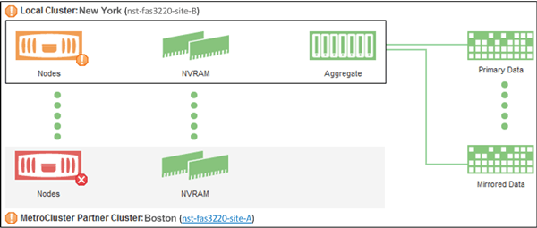

= Vérifier la santé des clusters dans une configuration MetroCluster
:allow-uri-read: 
:icons: font
:imagesdir: ../media/

[role="lead"]
Vous pouvez utiliser Active IQ Unified Manager (Unified Manager) pour vérifier l'état de fonctionnement des clusters et de leurs composants dans les configurations MetroCluster over FC et MetroCluster over IP. Si les clusters étaient impliqués dans un événement de performances détecté par Unified Manager, l'état de santé peut vous aider à déterminer si un problème matériel ou logiciel a contribué à l'événement.

.Avant de commencer
* Vous devez avoir le rôle opérateur, administrateur d'applications ou administrateur de stockage.
* Vous devez avoir analysé un événement de performance pour une configuration MetroCluster et obtenu le nom du cluster concerné.
* Les deux clusters de la configuration MetroCluster sur FC et IP doivent être surveillés par la même instance de Unified Manager.

== Déterminer l'état du cluster dans MetroCluster via la configuration FC

Suivez ces étapes pour déterminer l'état du cluster dans une configuration MetroCluster sur FC.

.Étapes
. Dans le volet de navigation de gauche, cliquez sur *Event Management* pour afficher la liste des événements.
. Dans le panneau filtre, sélectionnez tous les filtres MetroCluster dans la catégorie *Type de source*. Tous les événements soulevés dans votre environnement pour toutes les configurations MetroCluster.
. Cliquez sur le nom du cluster en regard d'un événement MetroCluster.
+
[NOTE]
====
Si aucun événement MetroCluster n'est affiché, vous pouvez utiliser la barre de recherche pour rechercher le nom du cluster impliqué dans l'événement lié à votre configuration MetroCluster over FC.

====
+
La vue Santé : tous les clusters s'affiche avec des informations détaillées sur l'événement.

. Sélectionnez l'onglet *connectivité MetroCluster* pour afficher l'intégrité de la connexion entre le cluster sélectionné et son cluster partenaire.
+
image::../media/opm_um_mcc_connectivity_tab_png.gif[Onglet Unified Manager MetroCluster Connectivity]

+
Dans cet exemple, les noms et les composants du cluster local et de son cluster partenaire sont affichés. Une icône jaune ou rouge indique un événement de santé pour le composant mis en surbrillance. L'icône connectivité représente le lien entre les clusters. Vous pouvez pointer le curseur de la souris sur une icône pour afficher les informations sur les événements ou cliquer sur l'icône pour afficher les événements. Un problème de santé peut avoir contribué à l'événement de performance sur l'un ou l'autre des clusters.

+
Unified Manager surveille le composant NVRAM de la liaison entre les clusters. Si l'icône des commutateurs FC sur le cluster local ou partenaire ou l'icône de connectivité est rouge, un problème de santé de la liaison peut avoir causé l'événement de performances.

. Sélectionnez l'onglet *réplication MetroCluster*.
+

+
Dans cet exemple, si l'icône NVRAM du cluster local ou partenaire est jaune ou rouge, un problème de santé lié à la mémoire NVRAM peut avoir provoqué l'événement de performances. Si aucune icône rouge ou jaune n'est affichée sur la page, un problème de performances peut avoir été causé par l'événement de performances du cluster partenaire.

== Déterminer l'état du cluster dans la configuration MetroCluster sur IP

Procédez comme suit pour déterminer l'intégrité du cluster dans une configuration MetroCluster sur IP.

.Étapes
. Dans le volet de navigation de gauche, cliquez sur *Event Management* pour afficher la liste des événements.
. Dans le panneau filtre, sous la catégorie *Source Type*, sélectionnez `MetroCluster Relationship` filtre. Tous les événements soulevés dans votre environnement pour toutes les configurations MetroCluster.
+
[NOTE]
====
Si vous ne voyez pas les événements MetroCluster signalés, vous pouvez utiliser la barre de recherche pour effectuer une recherche par le nom du cluster concerné dans l'événement lié à votre configuration MetroCluster sur IP.

====
. Cliquez sur le nom du cluster, en regard de l'événement MetroCluster qui vous concerne. La page clusters s'affiche avec les détails de ce cluster. Pour plus d'informations sur la détermination des problèmes de santé, reportez-vous à la section link:../storage-mgmt/task_monitor_metrocluster_configurations.html["Surveiller les problèmes de connectivité dans la configuration MetroCluster sur IP"].

