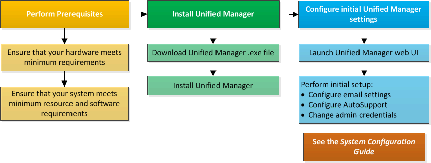

= Découvrez le processus d'installation d'Active IQ Unified Manager sous Windows
:allow-uri-read: 
:icons: font
:imagesdir: ../media/

[role="lead"]
Le workflow d'installation décrit les tâches que vous devez effectuer avant d'utiliser Unified Manager.

