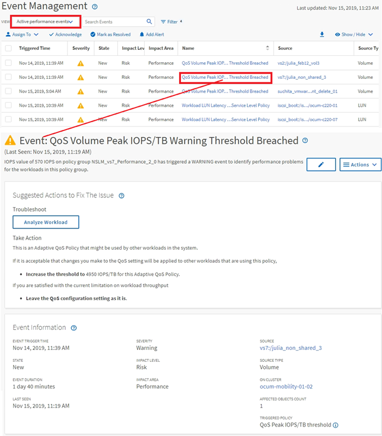

= Navigation dans l'investigation des événements
:allow-uri-read: 
:icons: font
:imagesdir: ../media/

[role="lead"]
Les pages de détail des événements d'Unified Manager vous donnent une vue d'ensemble de tous les événements de performance. Cela peut être bénéfique lors de l'étude des événements de performance, du dépannage et de l'ajustement des performances du système.

En fonction du type d'événement de performance, vous pouvez voir l'un des deux types de pages détaillées d'événements :

* Page de détails des événements pour les événements de stratégie de seuil définis par l'utilisateur et par le système
* Page de détails des événements pour les événements de stratégie de seuil dynamique

C'est un exemple de navigation pour l'investigation d'événement.

. Dans le volet de navigation de gauche, cliquez sur *Event Management*.
. Dans le menu Affichage, cliquez sur *événements de performances actifs*.
. Cliquez sur le nom de l'événement que vous souhaitez examiner et la page Détails de l'événement s'affiche.
. Affichez la description de l'événement et examinez les actions suggérées (le cas échéant) pour afficher plus de détails sur l'événement qui peut vous aider à résoudre le problème. Vous pouvez cliquer sur le bouton *Analyze Workload* pour afficher des graphiques de performances détaillés afin de mieux analyser le problème.

