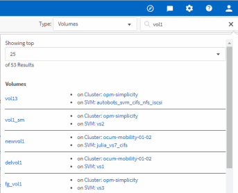

= Rechercher des objets de stockage
:allow-uri-read: 
:icons: font
:imagesdir: ../media/

[role="lead"]
Pour accéder rapidement à un objet spécifique, vous pouvez utiliser le champ *Rechercher tous les objets de stockage* en haut de la barre de menus. Cette méthode de recherche globale sur tous les objets vous permet de localiser rapidement des objets spécifiques par type. Les résultats de la recherche sont classés par type d'objet de stockage et vous pouvez les filtrer dans le menu déroulant. Une recherche valide doit contenir au moins trois caractères.

La recherche globale affiche le nombre total de résultats, mais seuls les 25 meilleurs résultats sont accessibles. Pour cette raison, la fonction de recherche globale peut être considérée comme un outil de raccourci pour trouver des éléments spécifiques si vous connaissez les éléments que vous voulez rapidement localiser. Pour des résultats de recherche complets, vous pouvez utiliser la recherche dans les pages d'inventaire d'objets et sa fonctionnalité de filtrage associée.

Vous pouvez cliquer sur la liste déroulante et sélectionner *tous* pour effectuer une recherche simultanée sur tous les objets et événements. Vous pouvez également cliquer sur la liste déroulante pour spécifier le type d'objet. Saisissez au moins trois caractères du nom de l'objet ou de l'événement dans le champ *Rechercher tous les objets de stockage*, puis appuyez sur *entrée* pour afficher les résultats de la recherche, tels que :

* Clusters : noms de cluster
* Nœuds : noms des nœuds
* Agrégats : noms des agrégats
* SVM : noms des SVM
* Volumes : noms des volumes
* LUN : chemins de LUN

[NOTE]
====
Les LIFs et les ports ne sont pas interrogeables dans la barre de recherche globale.

====
Dans cet exemple, le type d'objet Volume est sélectionné dans la liste déroulante. La saisie de « vol » dans le champ *Rechercher tous les objets de stockage* affiche la liste de tous les volumes dont les noms contiennent ces caractères. Pour les recherches d'objets, vous pouvez cliquer sur n'importe quel résultat de recherche pour accéder à la page de l'explorateur de performances de cet objet. Pour la recherche d'événements, cliquez sur un élément dans le résultat de la recherche pour accéder à la page Détails de l'événement.
