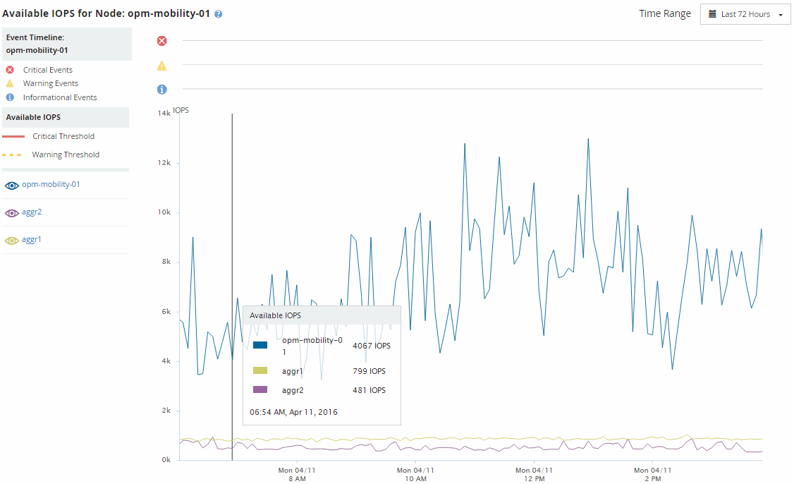

= Afficher les valeurs IOPS disponibles pour les nœuds et les agrégats
:allow-uri-read: 
:icons: font
:imagesdir: ../media/

[role="lead"]
Vous pouvez contrôler les valeurs d'IOPS disponibles pour tous les nœuds ou pour tous les agrégats d'un cluster, ou afficher les détails d'un seul nœud ou agrégat.

Les valeurs d'IOPS disponibles apparaissent sur les pages Performance Inventory et dans les graphiques de la page Performance Explorer pour les nœuds et les agrégats. Par exemple, lorsque vous affichez un nœud dans la page Explorateur de nœuds/performances, vous pouvez sélectionner le compteur « IOPS disponibles » dans la liste afin de pouvoir comparer les valeurs d'IOPS disponibles pour le nœud et plusieurs agrégats sur ce nœud.

Surveiller le compteur IOPS disponible vous permet d'identifier :

* Les nœuds ou les agrégats qui disposent des valeurs d'IOPS les plus élevées pour déterminer l'emplacement où les futurs workloads peuvent être déployés.
* Pour identifier les ressources dont vous devez contrôler les problèmes de performance futurs, les nœuds ou les agrégats disposant des valeurs d'IOPS les plus faibles.
* Les volumes et les LUN les plus sollicités d'un agrégat qui dispose d'une faible valeur des IOPS disponibles.

