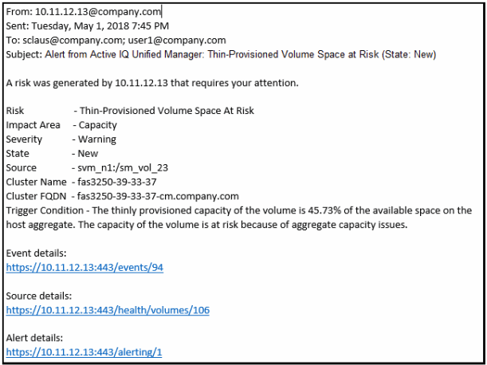

= Les informations contenues dans un e-mail d'alerte
:allow-uri-read: 
:icons: font
:imagesdir: ../media/

[role="lead"]
Dans les e-mails d'alerte Unified Manager, vous indiquez le type d'événement, la gravité de l'événement, le nom de la règle ou le seuil non respecté pour provoquer l'événement et la description de l'événement. L'e-mail fournit également un lien hypertexte pour chaque événement qui vous permet d'afficher la page de détails de l'événement dans l'interface utilisateur.

Les e-mails d'alerte sont envoyés à tous les utilisateurs qui se sont abonnés pour recevoir des alertes.

Si un compteur de performances ou une valeur de capacité a un changement important pendant une période de collecte, cela peut provoquer le déclenchement d'un événement critique et d'un événement d'avertissement en même temps pour la même stratégie de seuil. Dans ce cas, vous pouvez recevoir un e-mail pour l'événement d'avertissement et un autre pour l'événement critique. En effet, Unified Manager vous permet de vous abonner séparément pour recevoir des alertes en cas d'avertissement ou de franchissement de seuils critiques.

Voici un exemple d'e-mail d'alerte :

