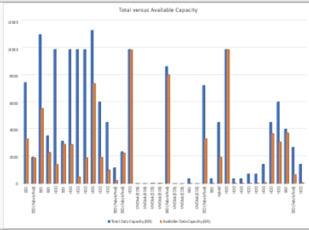

= Création d'un rapport pour afficher le total des agrégats par rapport aux graphiques de capacité disponible
:allow-uri-read: 
:icons: font
:imagesdir: ../media/

[role="lead"]
Vous pouvez créer un rapport pour analyser le total du stockage et la capacité engagée au format Excel.

*Ce dont vous aurez besoin*

* Vous devez avoir le rôle Administrateur d'applications ou Administrateur de stockage.

Procédez comme suit pour ouvrir une vue Santé : tous les agrégats, télécharger la vue dans Excel, créer un graphique des capacités totales et allouées, charger le fichier Excel personnalisé et planifier le rapport final.

.Étapes
. Dans le volet de navigation de gauche, cliquez sur *Storage* > *Aggregates*.
. Sélectionnez *Rapports* > *Télécharger Excel*.
+
image::../media/download_excel_menu.png[téléchargez le menu excel]

+
Selon votre navigateur, vous devrez peut-être cliquer sur *OK* pour enregistrer le fichier.

. Dans Excel, ouvrez le fichier téléchargé.
. Si nécessaire, cliquez sur *Activer la modification*.
. Sur la feuille de données, cliquez avec le bouton droit de la souris sur la colonne Type et sélectionnez *Trier* > *Trier A à Z*.
+
image::../media/sort_01.png[tri 01]

+
Cette action organisera vos données en fonction du type de stockage :

+
** DISQUES DURS
** Hybride
** SSD
** SSD (FabricPool)

. Sélectionner `Type, Total Data Capacity,` et `Available Data Capacity` colonnes.
. Dans le menu *Insert*, sélectionnez A. `3-D column` tableau.
+
Le graphique apparaît sur la feuille de données.

+
image::../media/3d_column_01.png[colonne 3d 01]

. Cliquez avec le bouton droit de la souris sur le graphique et sélectionnez *déplacer le graphique*.
. Sélectionnez *Nouvelle feuille* et nommez la feuille *cartes de stockage totales*.
+
[NOTE]
====
Assurez-vous que la nouvelle feuille apparaît après les fiches d'informations et de données.

====
. Nommez le titre du graphique *Total par rapport à la capacité disponible*.
. Les menus *Design* et *format*, disponibles lorsque le graphique est sélectionné, vous pouvez personnaliser l'apparence du graphique.
. Lorsque vous êtes satisfait, enregistrez le fichier avec vos modifications. Ne modifiez pas le nom ou l'emplacement du fichier.
+

. Dans Unified Manager, sélectionnez *Rapports* > *Upload Excel*.
+
[NOTE]
====
Assurez-vous que vous vous trouvez dans la même vue que celle où vous avez téléchargé le fichier Excel.

====
. Sélectionnez le fichier Excel que vous avez modifié.
. Cliquez sur *Ouvrir*.
. Cliquez sur *soumettre*.
+
Une coche apparaît en regard de l'option de menu *Rapports* > *Télécharger Excel*.

+
image::../media/upload_excel.png[télécharger excel]

. Cliquez sur *Rapports planifiés*.
. Cliquez sur *Add Schedule* pour ajouter une nouvelle ligne à la page *Report Schedules* afin que vous puissiez définir les caractéristiques du planning pour le nouveau rapport.
+
[NOTE]
====
Sélectionnez le format *XLSX* pour le rapport.

====
. Entrez un nom pour le planning du rapport et remplissez les autres champs du rapport, puis cliquez sur la coche (image:../media/blue_check.gif[""]) à la fin du rang.
+
Le rapport est envoyé immédiatement sous forme de test. Ensuite, le rapport génère et est envoyé par e-mail aux destinataires répertoriés à l'aide de la fréquence spécifiée.

En fonction des résultats présentés dans ce rapport, vous pouvez équilibrer la charge sur vos agrégats.
