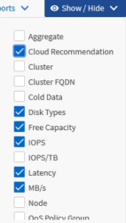

= Création rapide de rapports
:allow-uri-read: 
:icons: font
:imagesdir: ../media/

[role="lead"]
Créez un modèle de rapport personnalisé afin de découvrir les vues et les rapports de planification. Ce rapport de démarrage rapide trouve une liste de volumes que vous pouvez déplacer vers le Tier cloud, car il existe une quantité équitable de données inactives. Vous ouvrez la vue Performance: Tous les volumes, personnalisez la vue à l'aide de filtres et de colonnes, enregistrez la vue personnalisée en tant que rapport et planifiez le partage du rapport une fois par semaine.

.Avant de commencer
* Vous devez avoir le rôle Administrateur d'applications ou Administrateur de stockage.
* Vous devez avoir configuré des agrégats FabricPool et certains volumes sur ces agrégats.

Procédez comme suit pour :

* Ouvrez la vue par défaut
* Personnalisez les colonnes en filtrant et en triant les données
* Enregistrez la vue
* Planifier la génération d'un rapport pour la vue personnalisée

.Étapes
. Dans le volet de navigation de gauche, cliquez sur *Storage* > *volumes*.
. Dans le menu Affichage, sélectionnez *Performance* > *tous les volumes*.
. Cliquez sur *Afficher/Masquer* pour vous assurer que la colonne "types de disque" s'affiche dans la vue.
+

+
Ajoutez ou supprimez d'autres colonnes pour créer une vue contenant les champs importants pour votre rapport.

. Faites glisser la colonne "types de disque" à côté de la colonne "recommandations sur le cloud".
. Cliquez sur l'icône de filtre pour ajouter les trois filtres suivants, puis cliquez sur *appliquer le filtre* :
+
** Les types de disques contiennent la FabricPool
** La recommandation cloud contient le Tier
** Données inactives supérieures à 10 Go
image:../media/filter_cold_data_2.png["Capture d'écran de l'interface utilisateur montrant comment appliquer un filtre à partir de l'option de filtre."]

+
Notez que chaque filtre est associé à une logique et que tous les volumes renvoyés doivent répondre à tous les critères. Vous pouvez ajouter jusqu'à cinq filtres.

. Cliquez sur la partie supérieure de la colonne données froides pour trier les résultats afin que les volumes avec les données les plus froides apparaissent en haut de la vue.
. Lorsque la vue est personnalisée, le nom de la vue est vue non enregistrée. Nommez la vue pour refléter ce que la vue montre, par exemple « vols change Tiering policy ». Lorsque vous avez terminé, cliquez sur la coche ou appuyez sur *entrée* pour enregistrer la vue avec le nouveau nom.
+
image::../media/report_vol_code_data_2.png[Capture d'écran de l'interface utilisateur affichant la page de règle de changement de Tiering des volumes avec les colonnes requises dans le bon ordre.]

. Téléchargez le rapport sous forme de fichier *CSV*, *Excel* ou *PDF* pour voir le résultat avant de le planifier ou de le partager.
+
Ouvrez le fichier avec une application installée, telle que Microsoft Excel (CSV ou Excel) ou Adobe Acrobat (PDF), ou enregistrez le fichier.

+
[NOTE]
====
Vous pouvez personnaliser davantage votre rapport à l'aide de filtres, de tri, de tableaux croisés dynamiques ou de graphiques complexes en téléchargeant la vue sous forme de fichier Excel. Une fois le fichier ouvert dans Excel, utilisez les fonctions avancées pour personnaliser votre rapport. Lorsque vous êtes satisfait, chargez le fichier Excel. Ce fichier, avec ses personnalisations, est appliqué à la vue lorsque le rapport est exécuté.

====
+
Pour plus d'informations sur la personnalisation des rapports à l'aide d'Excel, reportez-vous à la section _Sample Microsoft Excel Reports_.

. Cliquez sur le bouton *Rapports planifiés* sur la page d'inventaire. Tous les rapports programmés relatifs à l'objet, dans ce cas, les volumes, apparaissent dans la liste.
+
image::../media/scheduled_reports_3.gif[Capture d'écran de l'interface utilisateur qui affiche tous les rapports planifiés liés à l'objet.]

. Cliquez sur *Ajouter un programme* pour ajouter une nouvelle ligne à la page programmes de rapports afin de définir les caractéristiques de planification du nouveau rapport.
. Entrez un nom pour le rapport et complétez les autres champs du rapport, puis cliquez sur la coche (image:../media/blue_check.gif[""]) à la fin du rang.
+
Le rapport est envoyé immédiatement sous forme de test. Ensuite, le rapport génère et est envoyé par e-mail aux destinataires répertoriés à l'aide de la fréquence spécifiée.

+
Le rapport suivant est au format CSV :

+
image::../media/csv_sample_report.gif[Capture d'écran de l'interface utilisateur affichant un exemple de rapport au format CSV.]

+
L'exemple de rapport suivant est au format PDF :

+
image::../media/pdf_sample_report.gif[Capture d'écran de l'interface utilisateur affichant un exemple de rapport au format PDF.]

En fonction des résultats présentés dans ce rapport, vous pouvez utiliser ONTAP System Manager ou l'interface de ligne de commande de ONTAP pour modifier la règle de Tiering en « automatique » ou « toutes » pour certains volumes, afin de décharger des données plus inactives vers le Tier cloud.
