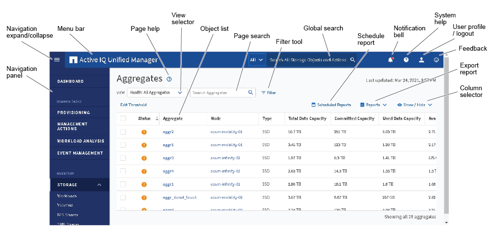

= Dispositions de fenêtre types
:allow-uri-read: 
:icons: font
:imagesdir: ../media/

[role="lead"]
La compréhension des dispositions de fenêtre types vous permet de naviguer et d'utiliser Active IQ Unified Manager efficacement. La plupart des fenêtres Unified Manager sont similaires à l'une des deux présentations générales : liste d'objets ou détails. Le paramètre d'affichage recommandé est d'au moins 1280 x 1024 pixels.

Toutes les fenêtres ne contiennent pas tous les éléments des schémas suivants.

== Disposition de la fenêtre de liste d'objets

== Disposition de la fenêtre Détails de l'objet

image::../media/object_details.gif[détails de l'objet]
